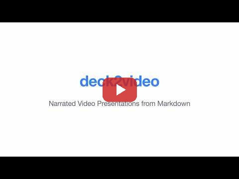

# deck2video

Turn a [Marp](https://marp.app/) or [Slidev](https://sli.dev/) slide deck into a
narrated video. Write your slides in Markdown, add speaker notes as HTML
comments, and deck2video handles the rest: rendering, text-to-speech with voice
cloning, and final MP4 assembly. The presentation format is auto-detected.

[](https://www.youtube.com/watch?v=6T1b-fIO3cw)

## Quick Start

```bash
source setup.sh
python -m deck2video presentation.md --voice voice-sample.wav
```

The setup script checks for system dependencies, creates a Python 3.11 virtual
environment, installs packages, and activates the venv in your shell.

## Documentation

Detailed guides covering every feature and workflow:

- [Getting started](docs/getting-started.md) -- installation, setup, first run
- [Writing slides](docs/writing-slides.md) -- slide authoring for Marp and Slidev
- [Format detection](docs/format-detection.md) -- how auto-detection works, when to override
- [Voice and TTS](docs/voice-and-tts.md) -- voice cloning, tuning, pronunciation overrides
- [Video assembly](docs/video-assembly.md) -- screencasts, framerate, padding, output format
- [CLI reference](docs/cli-reference.md) -- flag-by-flag reference
- [Interactive mode](docs/interactive-mode.md) -- review workflow for TTS audio
- [Troubleshooting](docs/troubleshooting.md) -- common problems and debugging
- [Examples](docs/examples.md) -- worked examples and recipes

## Requirements

- **Python 3.11**
- **Node.js / npm** (for marp-cli via npx)
- **ffmpeg**

For Slidev presentations (optional):
- **@slidev/cli** (`npm install -g @slidev/cli`)
- **playwright-chromium** (`npm install -g playwright-chromium && npx playwright install chromium`)

On macOS:

```bash
brew install python@3.11 node ffmpeg
```

## Writing Slides

Speaker notes go in HTML comments. Slides without notes get a silent hold.
Both Marp and Slidev formats are supported — the format is auto-detected from
frontmatter and content, or you can specify it explicitly with `--format`.

### Marp Example

```markdown
---
marp: true
---

# Welcome

<!-- This is the opening slide. The audience will hear this narration. -->

---

# Architecture

<!-- Our system has three main components.
Each one handles a different part of the pipeline. -->

---

# Live Demo

<!-- video: assets/demo.mov -->

<!-- Watch as we deploy the service to production. -->

---

# Questions?
```

### Slidev Example

```markdown
---
transition: slide-left
---

# Welcome

<!-- This is the opening slide. The audience will hear this narration. -->

---
layout: center
---

# Architecture

<!-- Our system has three main components. -->

---

# Questions?
```

## Usage

```bash
python -m deck2video <input.md> [options]
```

### Options

| Flag | Default | Description |
|------|---------|-------------|
| `--format` | `auto` | Presentation format: `auto`, `marp`, or `slidev` |
| `--output` | `<input>.mp4` | Output file path |
| `--voice` | none | Reference WAV for voice cloning |
| `--language` | none | Language code for multilingual TTS (e.g. `fr`, `zh`, `de`) |
| `--device` | `auto` | Torch device: `auto`, `cpu`, `cuda`, `mps` |
| `--exaggeration` | `0.5` | Chatterbox vocal exaggeration |
| `--cfg-weight` | `0.5` | Chatterbox classifier-free guidance weight |
| `--temperature` | `0.8` | Chatterbox sampling temperature |
| `--hold-duration` | `3.0` | Seconds to hold slides with no notes |
| `--fps` | `auto` | Output framerate (auto-detected from screencasts, or 24) |
| `--temp-dir` | system temp | Directory for intermediate files |
| `--pronunciations` | none | JSON file mapping words to phonetic respellings |
| `--audio-padding` | `0` | Milliseconds of silence before and after each slide's audio |
| `--interactive`, `-i` | off | Review and approve each slide's TTS audio before continuing |
| `--keep-temp` | off | Preserve intermediate files after rendering |
| `--reassemble` | off | Skip parse/render/TTS; assemble MP4 from existing temp dir files |
| `--redo-slides` | none | Regenerate TTS for listed slides (e.g. `2,3,7`), then reassemble |

### Examples

```bash
# Basic conversion (uses default TTS voice)
python -m deck2video deck.md

# Voice cloning with tuned generation parameters
python -m deck2video deck.md \
    --voice ~/models/my-voice.wav \
    --output talk.mp4 \
    --exaggeration 0.5 \
    --cfg-weight 0.3 \
    --temperature 0.6

# Force CPU and keep intermediate files for debugging
python -m deck2video deck.md \
    --device cpu \
    --keep-temp \
    --temp-dir ./build

# With pronunciation overrides
python -m deck2video deck.md \
    --voice ~/models/my-voice.wav \
    --pronunciations pronunciations.json

# Explicit Slidev format
python -m deck2video slidev-deck.md --format slidev --voice voice.wav

# Reassemble video from existing temp dir (no re-render or TTS)
python -m deck2video deck.md --reassemble --temp-dir ./build

# Redo TTS for specific slides and reassemble
python -m deck2video deck.md --redo-slides 2,5,7 --temp-dir ./build --voice voice.wav
```

## Interactive Mode

Use `--interactive` (or `-i`) to review each slide's audio before moving on.
After each slide is synthesized, the audio plays automatically and you're
prompted:

```
(y) keep  (n) regenerate  (r) replay  (q) quit:
```

- **y** (or Enter) -- Accept the audio and continue to the next slide.
- **n** -- Discard and regenerate the audio with a new TTS pass.
- **r** -- Replay the current audio without regenerating.
- **q** -- Quit the pipeline immediately.

This is useful for catching bad TTS output early rather than waiting for the
full pipeline to finish.

## Reassemble and Redo Slides

After a full pipeline run with `--keep-temp` or `--temp-dir`, you can
selectively redo work without re-running the entire pipeline.

**Reassemble only** (e.g., after editing audio files manually):

```bash
python -m deck2video deck.md --reassemble --temp-dir ./build
```

This skips parsing, rendering, and TTS entirely. It picks up the existing
slide images and audio WAVs in the temp directory and assembles a new MP4.

**Redo specific slides** (e.g., slides 2 and 5 had bad TTS):

```bash
python -m deck2video deck.md --redo-slides 2,5 --temp-dir ./build --voice voice.wav
```

This re-parses the markdown to get the current speaker notes, regenerates TTS
audio for only the listed slides, then reassembles the full video. Slide
numbers are 1-based and match the indices shown during a normal run.

Both flags require `--temp-dir` pointing to a directory from a previous run.
They are mutually exclusive (you can't use both at once).

## Embedding Screencasts

You can replace a slide's static image with a video file (e.g. a screen
recording or demo). Add a `video` directive in an HTML comment:

```markdown
---

# Live Demo

<!-- video: assets/demo.mov -->

<!-- Here we walk through the deployment process step by step. -->
```

The video replaces the rendered slide image for that slide. The screencast's
original audio is stripped and replaced with the TTS narration from your speaker
notes. If the narration is longer than the video, the last frame is frozen until
the audio finishes. Video paths are resolved relative to the input markdown file.

When screencasts are present, the output framerate is automatically set to match
the highest framerate among the embedded videos (rather than the default 24 fps).
You can still override this with `--fps`.

## Pronunciation Overrides

The TTS engine sometimes mispronounces technical terms, acronyms, or proper
nouns. You can fix this with a JSON file that maps words or phrases to phonetic
respellings:

```json
{
  "kubectl": "cube control",
  "nginx": "engine X",
  "PostgreSQL": "post gress Q L",
  "Kubernetes": "koo ber net eez"
}
```

Pass it with `--pronunciations`:

```bash
python -m deck2video deck.md --pronunciations pronunciations.json
```

Matching is case-insensitive. Longer phrases are matched first, so a multi-word
key like `"Visual Studio Code"` will match before `"Code"` on its own.

## How It Works

0. **Detect** -- Auto-detect the presentation format (Marp or Slidev) from
   frontmatter and content markers. Skipped when `--format` is explicit.
1. **Parse** -- Split the Markdown on `---` delimiters, extract speaker notes
   from `<!-- -->` comments.
2. **Render** -- Call marp-cli (or Slidev CLI) to produce a PNG image per slide.
3. **TTS** -- Synthesize each slide's notes with Chatterbox. Long notes are
   split by sentence and reassembled into one WAV per slide. Slides without
   notes become silent holds.
4. **Assemble** -- Build a video segment per slide (image looped over the
   audio duration, or screencast video with TTS audio replacing the original
   track), then concatenate everything into the final MP4 with ffmpeg.

With `--reassemble`, only step 4 runs. With `--redo-slides`, steps 1, 3
(for selected slides only), and 4 run.
